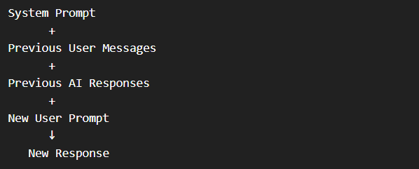
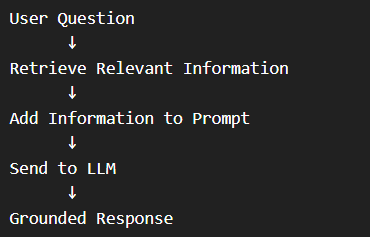
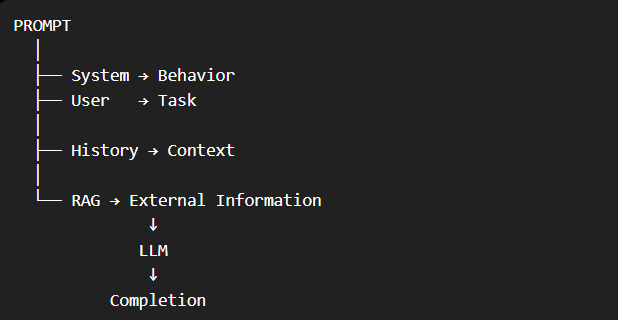

# Prompts in Generative AI

A **prompt** is the input provided to a Large Language Model (LLM) to generate a response, called a **completion**. A prompt can be a question, command, instruction, or conversational message.

## 1\. Types of Prompts

There are generally two types of prompts:

### 1. System Prompt

A **system prompt** defines the model's overall:

-   Behavior
-   Tone
-   Constraints
-   Response style

**Example:**

> You are a helpful assistant that responds in a cheerful and friendly manner.

**Key idea:**  
**System prompt = How the model should behave**

Usually, the **application** defines the system prompt.

### 2. User Prompt

A **user prompt** contains the specific question, command, or instruction that the user wants the model to respond to.

- **Example:**

> Summarize the key considerations for adopting generative AI

> for a corporate executive. Use no more than six bullet points.

- **Key idea:**  
**User prompt = What the user wants the model to do**

---

## 2\. System Prompt vs User Prompt

| Type | Purpose | Usually Created By |
| --- | --- | --- |
| **System Prompt** | Defines behavior, tone & constraints | Application |
| **User Prompt** | Gives the specific task/question | User or application |

### 🧠 Easy Memory

**System → Behavior**  
**User → Task**

---

# Conversation History

Generative AI applications often maintain conversation history to keep responses consistent and relevant.

The model can receive:

**Example**

**User:** What are the key considerations for adopting Generative AI?

**AI**: Governance, privacy, security, organizational readiness...

**User**: What are common privacy-related risks?

> The second question makes more sense when the model receives the previous conversation as context.

### 📌 Key idea:
Conversation history gives the model context for follow-up questions.

---

# 4\. Retrieval-Augmented Generation (RAG)

**RAG = Retrieval-Augmented Generation**

RAG provides the model with **relevant external information** before generating a response.

### Basic Process

### Example

Suppose an employee asks:

> **"Is it holiday tomorrow?"**

Without additional information, the model can only give a **generic answer**.

**With RAG**:

Question
   +
Company Holiday Policy
   ↓
LLM
   ↓
Relevant Answer

> The application first retrieves the relevant sections of the company's holiday policy and includes them in the prompt.

📌 **Key idea:**  
**RAG = Retrieve relevant data → Add it to prompt → Generate a grounded answer**

---

# 5\. Tips for Better Prompts

Good prompts generally produce better and more useful responses.

### 1. Be Clear & Specific

So what's the type of bad and better promptingggg???

- **Bad**:

Tell me about AI.

- **Better**:

Explain generative AI to a beginner in 5 bullet points.

---

### 2 Add Context

Specify relevant information such as:

-   Topic
-   Audience
-   Purpose
-   Desired format

---

### 3 Provide Examples

If you want a particular style or format, **show an example** of what you want.

---

### 4 Ask for Structure

Tell the model how you want the answer organized:

-   Bullet points
-   Numbered lists
-   Tables
-   Specific sections

---

# 🔥 Quick Revision

| Concept | Meaning |
| --- | --- |
| **Prompt** | Input given to an LLM |
| **Completion** | Response generated by the LLM |
| **System Prompt** | Controls behavior, tone & constraints |
| **User Prompt** | Specifies the user's task/question |
| **Conversation History** | Previous messages used as context |
| **RAG** | Retrieves relevant information and adds it to the prompt |
| **Grounding** | Generating a response based on provided information |

## 🧠 One-Minute Memory

          
### ⭐ Besttt Rule for Prompting

> **Clear + Specific + Context + Examples + Structure = Better Results**