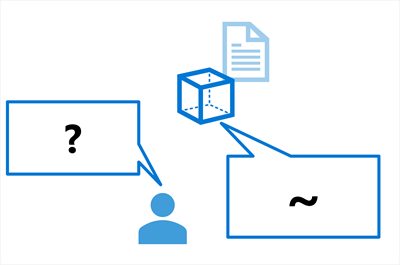
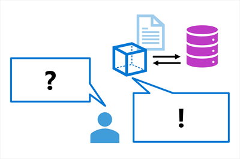
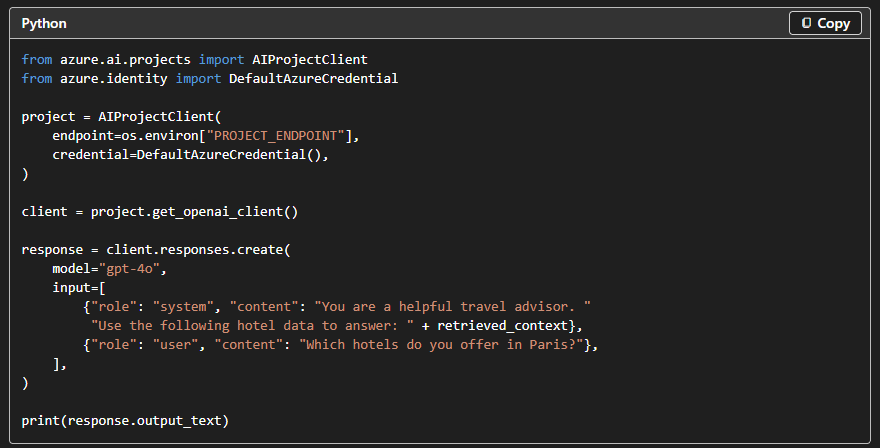

# Ground Your Model with Retrieval-Augmented Generation (RAG)

## 1\. What is Grounding?

**Grounding** means providing an AI model with **relevant, factual information from a trusted source** so it can use that information when generating a response.

A base model mainly relies on its **training data**, which:

-   Has a **knowledge cutoff**
-   Doesn't contain your organization's **private information**
-   May result in **plausible but incorrect/fabricated information**

> **Grounding = Give the model trusted context → Generate a more accurate response.**

---

## 2\. What is RAG?

**RAG = Retrieval-Augmented Generation**

RAG is the most common technique for **grounding** a language model.

It retrieves relevant information from a data source and adds it to the prompt before the model generates its response.

### 🔄 RAG Process

User Question
     ↓
RETRIEVE → Find relevant information
     ↓
AUGMENT → Add information to the prompt
     ↓
GENERATE → LLM generates grounded response

### Memory Trick

> **RAG = Retrieve → Augment → Generate**

---

## 3\. Ungrounded vs Grounded

### ❌ Ungrounded
The model relies only on its training data and might invent hotel names or details.



```
User Question
     ↓
LLM + Training Data
     ↓
Generic / Possibly Incorrect Response
```

Example:

> **"Which hotels do you offer in Paris?"**

Without your hotel data, the model might **invent hotel names or details**.

### ✅ Grounded
The model receives your actual hotel catalog data as context and responds with real hotel names, prices, and availability.



User Question
     +
Actual Hotel Catalog
     ↓
LLM
     ↓
Data-backed Response

Now the model can answer using real hotel names, prices, and availability from the provided data.

## 4. Create Embedding for Search

RAG needs an efficient way to find relevant information.

This is where **embeddings** are used.

### What is an Embedding?

An **embedding** is a mathematical representation of text as a **vector (list of floating-point numbers)** that captures its meaning.

Example:
```
"Children played joyfully in the park."
              ↕
"Kids happily ran around the playground."
```

Although the words are different, their meanings are similar, so their **embedding vectors will be close together**.

## 5\. Cosine Similarity

**Cosine similarity** measures how similar two vectors are by calculating the **angle between them**.

```
Value close to 1 → Very similar
Value close to 0 → Less similar
```

This allows RAG systems to find relevant information even when the **exact keywords don't match**.

---

# 6\. Use Azure AI Search for Retrieval

**Azure AI Search** provides the **retrieval component** for RAG solutions in Microsoft Foundry.

It allows you to:

-   Bring your own data
-   Create a searchable index
-   Search the index
-   Retrieve relevant information

### 🔄 Basic Process

Your Data
   ↓
Create Embeddings
   ↓
Azure AI Search Index
   ↓
User Question
   ↓
Search Index
   ↓
Relevant Information
   ↓
LLM
   ↓
Grounded Response

## 7\. Data Sources

Data can come from sources such as:

-   **Azure Blob Storage**
-   **Azure Data Lake Storage Gen2**
-   **Microsoft OneLake**
-   Direct file uploads

---

## 8\. Types of Search

Azure AI Search supports several search techniques:

| Search | How it works |
| --- | --- |
| **Keyword Search** | Matches exact terms |
| **Semantic Search** | Matches the meaning of the query |
| **Vector Search** | Uses embeddings to find similar content |
| **Hybrid Search** ⭐ | Combines keyword, semantic & vector search |

> **Hybrid Search is recommended for generative AI applications.**

---

## 9\. RAG with Microsoft Foundry SDK

After creating an Azure AI Search index, you can connect it to a model through your Foundry project.

The basic idea is:



## 10. When to use RAG

RAG is most effective when:

-   **The model needs domain-specific knowledge**: Your organization has private data that the model wasn't trained on, like a product catalog, policy documents, or internal knowledge base.
-   **Information changes frequently**: Your data is updated regularly, such as inventory, pricing, or news. RAG retrieves current data at query time without retraining.
-   **Factual accuracy is critical**: You need responses grounded in real data rather than the model's general knowledge.
-   **The base model's training data has a cutoff**: Events or information that occurred after the model's training cutoff date need to be accessible.

For the travel agency scenario, RAG allows customers to ask questions about specific hotels, destinations, and booking policies, all grounded in the agency's actual catalog data.

# Quick Revision

| Concept | Remember |
| --- | --- |
| **Grounding** | Give model trusted external context |
| **RAG** | Retrieve → Augment → Generate |
| **Embedding** | Text represented as a numerical vector |
| **Cosine Similarity** | Measures vector similarity |
| **Azure AI Search** | Retrieves relevant information |
| **Vector Search** | Searches using embeddings |
| **Hybrid Search** | Combines multiple search methods |
| **Grounded Response** | Response based on provided data |

---

## 🔥 The Most Important Flow

```
YOUR DATA
   ↓
Embeddings
   ↓
Azure AI Search Index
   ↓
User Question
   ↓
Retrieve Relevant Data
   ↓
Augment Prompt
   ↓
LLM
   ↓
Grounded Response
```

